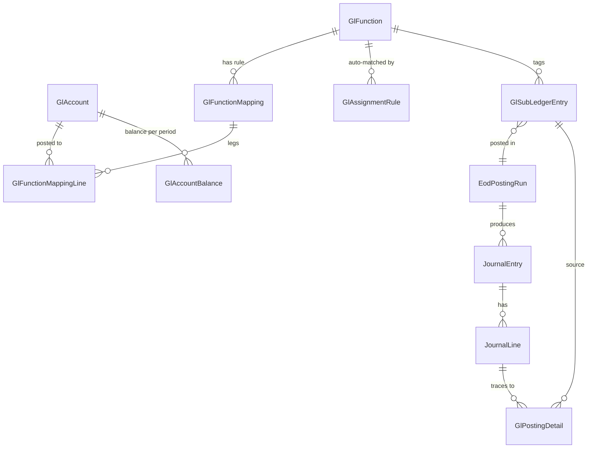

# Financial Transactions & GL Module — Design

> Status: **design proposal**, no code changes yet. Written to match PMIMS conventions in
> [`AGENTS.md`](../AGENTS.md), [`ARCHITECTURE.md`](../ARCHITECTURE.md), and
> [`docs/PERMISSIONS.md`](./PERMISSIONS.md). Follows the same operational/admin module
> segregation described in [`docs/MODULE_SEGREGATION_REVIEW.md`](./MODULE_SEGREGATION_REVIEW.md).

## 1. Why this module, and what exists today

PMIMS today has no internal chart of accounts or double-entry ledger. What looks like "GL"
is actually two unrelated things:

- `ReconciliationService` — compares PMIMS item balances against an assumed external
  Core Banking balance and raises `MismatchCase`s. It does not post anything.
- `CoreBankingLedgerPosting` — a free-text `DebitAccount`/`CreditAccount` string pair pushed
  to the external Core Banking system via `ICoreBankingLedgerService.PostLedgerEntryAsync`.
  There's no PMIMS-side account entity behind those strings, and nothing decides *which*
  accounts to use — callers hardcode them per call site.

This module adds a real, configurable internal GL: a chart of accounts, a user-defined
concept of "Function" (a business event that always posts the same way), a queue of
sub-transactions waiting to be assigned a Function, and an End-of-Day (EOD) batch that turns
the day's assigned sub-transactions into balanced journal entries against the chart of
accounts — the "reflect all sub-transactions on the main GL" step. It sits alongside, not
instead of, `CoreBankingLedgerPosting`: once a journal line exists internally, the same
`ICoreBankingLedgerService` adapter can optionally push it out to Core Banking, so the
external-posting code path is reused rather than duplicated.

## 2. Core concepts

| Term | Meaning |
| :--- | :--- |
| **GL Account** | A node in the chart of accounts (Asset/Liability/Equity/Revenue/Expense), optionally hierarchical. Only *postable* (leaf) accounts can receive journal lines. |
| **Function** | A user-defined label for "a kind of financial event" — e.g. `GOLD-SALE-RETAIL`, `VAULT-TRANSFER-INTERNAL`, `CUSTODY-FEE`. Deliberately **not** tied to the existing `TransactionType` enum, so it can also cover custody, dispensing, and fee events that aren't `InventoryTransaction`s at all. |
| **Function Mapping** | The posting rule for a Function: which account(s) get debited, which get credited, and the currency, valid over a date range. This is the thing an admin edits when they "assign a GL to a function." |
| **Assignment Rule** | An optional condition set (transaction type, ownership, location, metal type, amount range…) that auto-assigns a Function to an incoming sub-transaction, so staff don't have to tag every row by hand. |
| **Sub-Ledger Entry** | One row per financial event coming from any source module (inventory movement, custody action, dispensing, fee, manual adjustment) — the "sub transaction" the user described. Lives in a queue until it's assigned a Function and then posted. |
| **EOD Posting Run** | The batch job that, for a business date, assigns remaining Functions, groups sub-ledger entries by account, and writes balanced Journal Entries — "reflecting the sub-transactions on the main GL." |
| **Journal Entry / Journal Line** | The actual GL postings: one entry per run (or per function, see §5), made of debit/credit lines against GL Accounts. This *is* "the main GL." |
| **GL Period** | An open/closed accounting period (`yyyy-MM`), so a closed month can't silently receive new postings. |

## 3. Domain model

All new entities follow the existing style in `Entities.cs` (int PK named `<Entity>Id`,
`StatusCode` as a plain string, `CreatedBy`/`CreatedAt` audit pair, nav properties for FKs) and
`AppDbContext` conventions (snake_case table names, indexes on natural keys, no migrations —
`EnsureCreated()`).

```
GlAccount
  AccountId (PK)
  AccountCode        string, unique      e.g. "4010-GOLD-SALES"
  AccountName / AccountNameAr            bilingual, matches EN/AR pattern used elsewhere
  AccountType         ASSET|LIABILITY|EQUITY|REVENUE|EXPENSE
  ParentAccountId     FK -> GlAccount, nullable (self-referencing hierarchy)
  Currency            default "KWD"
  IsPostable          bool  (false = header/grouping account, true = leaf that can be posted to)
  StatusCode          ACTIVE|INACTIVE
  CreatedBy, CreatedAt

GlFunction
  FunctionId (PK)
  FunctionCode        string, unique      e.g. "GOLD-SALE-RETAIL"
  FunctionName / FunctionNameAr
  Description
  StatusCode          ACTIVE|INACTIVE
  CreatedBy, CreatedAt

GlFunctionMapping                          -- the posting rule for a Function
  MappingId (PK)
  FunctionId          FK -> GlFunction
  Currency
  EffectiveFrom / EffectiveTo (nullable)   -- versioned, never mutated in place (see §6)
  StatusCode          ACTIVE|SUPERSEDED
  CreatedBy, CreatedAt

GlFunctionMappingLine                      -- one or more legs of that rule
  MappingLineId (PK)
  MappingId            FK -> GlFunctionMapping
  AccountId             FK -> GlAccount
  Side                  DEBIT|CREDIT
  AllocationPercent     decimal, default 100  -- supports N-way splits (e.g. fee + VAT)

GlAssignmentRule                           -- optional auto-tagging, mirrors existing rules_engine
  RuleId (PK)
  FunctionId            FK -> GlFunction
  Priority              int  (lower = evaluated first)
  ConditionsJson        string  -- e.g. {"sourceModule":"INVENTORY_TRANSACTION","transactionType":"SALE","destinationOwnership":"CUSTOMER_OWNED"}
  StatusCode            ACTIVE|INACTIVE
  CreatedBy, CreatedAt

GlSubLedgerEntry                           -- the "sub transaction" queue
  EntryId (PK)
  SourceModule          string  e.g. "INVENTORY_TRANSACTION","CUSTODY","DISPENSING","FEE","MANUAL_ADJUSTMENT"
  SourceId               int    -- points back at InventoryTransaction.TransactionId etc. (generic, like CoreBankingLedgerPosting.SourceId)
  BusinessDate            date  -- the day this entry belongs to for EOD grouping
  Amount, Currency
  FunctionId              FK -> GlFunction, nullable until assigned
  StatusCode              UNASSIGNED|ASSIGNED|POSTED|EXCEPTION
  AssignedBy, AssignedAt   nullable (null + rule-derived = auto-assigned; non-null = manual override)
  PostingRunId             FK -> EodPostingRun, nullable until posted
  Notes

GlPeriod
  PeriodId (PK)
  PeriodCode              string "yyyy-MM", unique
  StartDate, EndDate
  StatusCode              OPEN|CLOSED
  ClosedBy, ClosedAt

EodPostingRun                              -- batch header, same shape as existing ReconciliationRun
  RunId (PK)
  BusinessDate
  RunTimestamp
  ExecutedBy              -- username, or "SYSTEM" if scheduled
  StatusCode              RUNNING|COMPLETED|COMPLETED_WITH_EXCEPTIONS|FAILED
  TotalEntriesProcessed, TotalAmountPosted, TotalExceptions

JournalEntry
  JournalEntryId (PK)
  PostingRunId            FK -> EodPostingRun
  BusinessDate
  Description
  StatusCode               POSTED|REVERSED
  CreatedAt

JournalLine
  JournalLineId (PK)
  JournalEntryId           FK -> JournalEntry
  AccountId                FK -> GlAccount
  DebitAmount, CreditAmount   -- exactly one non-zero
  Currency

GlPostingDetail                            -- drill-down bridge: which sub-transactions rolled into this line
  JournalLineId            FK -> JournalLine
  SubLedgerEntryId          FK -> GlSubLedgerEntry
  Amount

GlAccountBalance                           -- materialized running balance, for fast reporting
  AccountId               FK -> GlAccount
  PeriodId                 FK -> GlPeriod
  OpeningBalance, TotalDebits, TotalCredits, ClosingBalance
```



## 4. How a sub-transaction becomes a GL Function assignment

Any module that produces a financial event writes one `GlSubLedgerEntry` row (rather than each
module inventing its own posting logic). Concretely:

1. `InventoryTransaction`, custody actions, dispensing events, and fee/adjustment events each
   get a small hook that inserts a `GlSubLedgerEntry` (`SourceModule` + `SourceId` pointing back
   at the originating row, `Amount`, `Currency`, `BusinessDate`, `StatusCode = UNASSIGNED`).
2. Because `GlFunction` is decoupled from `TransactionType` (per your answer), assignment can
   come from **either**:
   - an `GlAssignmentRule` match (evaluated by priority against a small set of known
     attributes — transaction type, ownership, location, metal type, amount range — pulled
     from the source record), or
   - a manual override by an authorized user (`POST /api/gl/transactions/{id}/assign-function`),
     which always wins over a rule match and is recorded with `AssignedBy`.
3. Anything that matches no rule and has no manual assignment stays `UNASSIGNED` and is
   visible in a queue (`GET /api/gl/transactions/unassigned`) — it blocks that entry from EOD
   posting but never blocks the run itself (see exception handling in §5).

This keeps the "assign to function" step exactly as free-form as you asked for — an admin can
define any function they like (`"VIP-CUSTOMER-REBATE"`, `"SCRAP-METAL-INTAKE"`, whatever the
business needs) and either automate its tagging or leave it fully manual.

## 5. End-of-day posting process

Triggered manually (`POST /api/gl/eod/run { businessDate }`) or on a schedule. Runs inside one
DB transaction per business date so a failure rolls back cleanly:

1. **Guard.** `GlPeriod` covering `businessDate` must be `OPEN`. A prior `COMPLETED` run for
   the same date blocks a silent re-run (idempotent) — re-running requires an explicit
   admin-approved re-open, logged like the existing workflow-template "in-flight" guard in
   `SaveWorkflowTemplateAsync`.
2. **Auto-assignment pass.** For every `UNASSIGNED` entry with `BusinessDate <= businessDate`,
   evaluate `GlAssignmentRule`s in priority order; set `FunctionId` + `StatusCode = ASSIGNED`
   on a match. No match and no manual tag → `StatusCode = EXCEPTION` (surfaced the same way
   `MismatchCase` surfaces reconciliation breaks — a reviewable list, not a hard stop).
3. **Posting pass.** For every `ASSIGNED` entry, resolve the `GlFunctionMapping` active for that
   Function on `businessDate` (via `EffectiveFrom`/`EffectiveTo`). No active mapping → `EXCEPTION`.
   Group the resulting (account, side, amount) triples by account, and roll them into
   `JournalLine`s under one `JournalEntry` for the run (aggregated by account, not one line per
   sub-transaction — keeps the GL readable at day-end while `GlPostingDetail` preserves the
   drill-down back to every contributing `GlSubLedgerEntry`, which is the audit trail a
   Sharia-compliant ledger needs).
4. **Balance assertion.** Before committing, assert `SUM(DebitAmount) == SUM(CreditAmount)`
   per currency for the `JournalEntry`. If it doesn't balance (e.g. a mapping's
   `AllocationPercent`s don't sum to 100 on both sides), the whole run fails
   (`StatusCode = FAILED`) rather than posting a lopsided entry.
5. **Commit.** Mark posted `GlSubLedgerEntry` rows `POSTED` + `PostingRunId`; update
   `GlAccountBalance` for the period; write an `AuditLog` entry (existing convention, every
   write path already does this).
6. **Optional external push.** For each `JournalLine`, optionally call the existing
   `ICoreBankingLedgerService.PostLedgerEntryAsync` (reusing the current adapter, not a new
   one) with `SourceType = "GL_JOURNAL_LINE"`, `SourceId = JournalLineId`, recording the result
   in the existing `CoreBankingLedgerPosting` table. This is how the internal GL and the
   external Core Banking push stay connected without duplicating posting logic.
7. **Close out.** `EodPostingRun.StatusCode = COMPLETED` (or `COMPLETED_WITH_EXCEPTIONS` if any
   entries are still stuck in `EXCEPTION`), with totals.

**Corrections after posting:** never mutate a posted `JournalLine`. A late correction creates a
new `GlSubLedgerEntry` (`SourceModule = "MANUAL_ADJUSTMENT"` or similar) dated for the
correction's own business day, which flows through the same pipeline — consistent with the
project's "audit everything, never rewrite history" pattern.

**Out of scope for v1 (flag as open questions):** multi-currency FX conversion at posting time
(v1 assumes a sub-ledger entry's currency matches its Function Mapping's currency, KWD by
default, same as `CoreBankingLedgerPosting`); scheduling mechanism (can reuse the existing
`schedule` skill/cron pattern rather than building a new one).

## 6. Configuration rules (what makes this "dynamic")

- GL Accounts and Functions are pure user data — nothing is hardcoded in an enum. Creating,
  renaming, or deactivating either is a setup-time action, not a deploy.
- Function Mappings are **versioned, not edited in place**: changing which accounts a Function
  posts to creates a new `GlFunctionMapping` row with a new `EffectiveFrom` and closes the old
  one's `EffectiveTo`. This means past EOD runs still resolve against the mapping that was
  active on their business date — re-running history never changes because someone updated a
  mapping today. (Mirrors the reasoning behind the workflow-template in-place-update guard
  already in the codebase, just applied to mappings instead of templates.)
- Assignment Rules are ordered/priority-based and can be added or deactivated without touching
  code, same governance tier as `rules_engine` today.

## 7. Permissions (follows the existing operational/admin segregation)

Two new module keys, matching the pattern of `spatial_map`/`vault_location` and
`workflows`/`workflow_design`:

| Module key | Tier | Governs |
| :--- | :--- | :--- |
| `financial_gl` | Operational | View sub-ledger queue, view journal/GL balances, manually assign a Function to a transaction, trigger an EOD run, view run history/exceptions |
| `financial_gl_setup` | Administrative | Create/edit GL Accounts (chart of accounts), create/edit Functions, create/edit Function Mappings, create/edit Assignment Rules, open/close GL Periods |

Policy convention: `financial_gl.read` / `financial_gl.write`, `financial_gl_setup.read` /
`financial_gl_setup.write`, registered in `Program.cs` exactly like the other 21 modules.
`financial_gl.write` gates the sensitive operational actions (manual function assignment,
triggering EOD) — `financial_gl.read` is browse-only, mirroring how `workflows.read` is
browse-only and real actions sit behind a `.write` policy on a different module.

Given this is a 4-eyes (Maker-Checker) system, **EOD posting runs and new GL Account/Function
creation are good candidates to route through the existing `WorkflowTemplate`/
`WorkflowInstance` engine** (`workflow_design` to author the approval steps, `pending_actions`
for the actual approve/reject) rather than inventing a second approval mechanism — consistent
with how every other sensitive action in PMIMS already works.

Four-place wiring checklist (per `AGENTS.md` §6), applied to both new keys:

1. `DbSeeder.cs` → add `financial_gl`, `financial_gl_setup` to `allModules` and to each of the
   four seeded groups' permission dictionaries (`makerPerms`, `checkerPerms`, `reconPerms`,
   `adminPerms` — e.g. Reconciliation Officers (`grpRecon`) likely get `FULL` on
   `financial_gl`, `READ_ONLY` or `HIDDEN` on `financial_gl_setup`; IT Admin (`grpAdmin`) gets
   `FULL` on both).
2. `Program.cs` → register the four policies.
3. New controller file `PMIMSControllers.Gl.cs` (partial class, same pattern as
   `.Reports.cs`/`.Rules.cs`) → attribute every endpoint.
4. `frontend/src/App.tsx` → two new `MODULE_KEYS` entries with correct `tier`, gated by the
   existing `canAccess`/`canModify` helpers.

## 8. API surface (new `PMIMSControllers.Gl.cs` partial)

**Setup (`financial_gl_setup.read` / `.write`):**

```
GET    /api/gl/accounts
POST   /api/gl/accounts
PUT    /api/gl/accounts/{id}
GET    /api/gl/functions
POST   /api/gl/functions
PUT    /api/gl/functions/{id}
GET    /api/gl/functions/{id}/mappings
POST   /api/gl/functions/{id}/mappings          -- creates a new versioned mapping, closes prior
GET    /api/gl/assignment-rules
POST   /api/gl/assignment-rules
PUT    /api/gl/assignment-rules/{id}
POST   /api/gl/periods/{periodCode}/close
```

**Operational (`financial_gl.read` / `.write`):**

```
GET    /api/gl/transactions                     -- all sub-ledger entries, filter by date/status/function/account
GET    /api/gl/transactions/unassigned
GET    /api/gl/transactions/exceptions
POST   /api/gl/transactions/{id}/assign-function
GET    /api/gl/journal                          -- posted journal entries for a date range
GET    /api/gl/journal/{id}/detail              -- drill down via GlPostingDetail to source sub-ledger entries
GET    /api/gl/balances                         -- GlAccountBalance by account/period
POST   /api/gl/eod/run                          -- { businessDate }
GET    /api/gl/eod/runs
GET    /api/gl/eod/runs/{id}
```

## 9. Rollout notes

- New tables require a DB reseed (`EnsureCreated()`, no migrations) — delete
  `backend/PMIMS.WebAPI/pmims.db` after adding these entities, per the existing gotcha in
  `AGENTS.md`.
- Reuses `ICoreBankingLedgerService` and `CoreBankingLedgerPosting` as-is; no changes needed to
  the external-posting adapter.
- Does not touch `ReconciliationService` — that remains the "compare against external balance"
  check. Once this module exists, it becomes a natural (future) extension to have
  reconciliation compare `GlAccountBalance` against the external Core Banking balance instead
  of raw item counts, but that's a separate change and out of scope here.

## 10. Open questions for you before implementation

1. Which existing groups should get `FULL` vs `READ_ONLY` vs `HIDDEN` on the two new modules —
   same four seeded groups (Maker, Checker, Reconciliation, IT Admin), or does GL warrant a new
   dedicated group (e.g. "Finance/GL Officers")?
2. Should EOD posting and new-account/function creation actually go through the Maker-Checker
   workflow engine (recommended, per §7), or is a simple `.write` policy enough for v1?
3. Multi-currency: is KWD-only acceptable for v1, or do specific Functions need FX handling
   from day one?
4. Should EOD run on a schedule automatically (via the `schedule` mechanism) in addition to the
   manual trigger?
